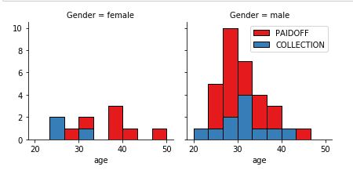
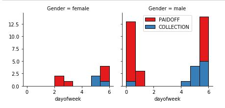
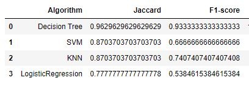
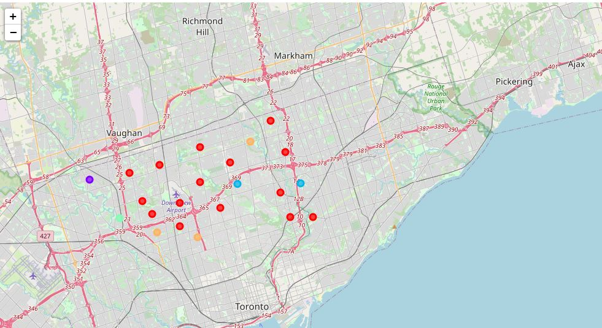
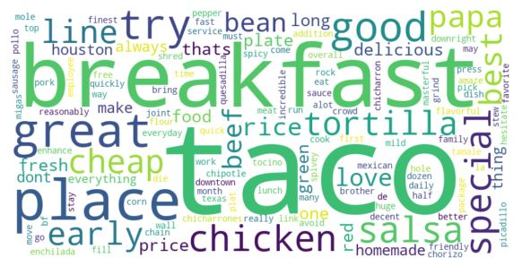

# IBM Professional Certification - Capstone

This repository is for the capstone project for the IBM Data Science Professional Certification. Three projects were completed for the final weeks of the program.

## Table of Contents

1. Predicting Loan Defaults - Four classifier algorithms (KNN, SVM, Logreg, and Decision Tree) were used on a small dataset to predict loan default based on student metrics
2. Clustering Toronto Neighborhoods - Toronto neighborhood location data was scraped from Wikipedia  
  - a.Clustering Toronto Neighborhoods.ipynb - Notebook showing complete project
  - b.Geospatial Coordinates.csv - longitude/latitude coordinates of neighborhoods compiled from Geolocator
  - c.Toronto.csv - Webscraped data from wikipedia with non-assigned neighborhoods filtered out and same borough neighborhoods grouped.
  
3. Autogenerate Review WordClouds - This is the **capstone project** for the certification course
  - a. Rough Business Proposal.ipynb  - a rough draft detailing the project inspiration and approach
  - b. Word Cloud Report.pdf - a formal report detailing the project
  - c. Word Cloud from Reviews with NLP.ipynb - Contains both a script for enterprise account API and a demonstration of the project
  
4. images - images for Github readme

## Brief Outline and Findings

### 1. Predicting Loan Defaults 

Exploratory data analysis revealed the following:

Women over the age of 30 were much more likely to pay off their loans and

People who received their loan at the end of the week were more likely to default for both genders.
Overall, the Decision Tree Classifier performed the best according to F1 and Jaccard Similarity Score:

### 2. Geospatial Clustering Toronto Neighborhoods

Neighborhoods in Downtown Toronto were clustered based on similar venues and mapped onto folium:

### 3. Capstone - WordCloud Tip Generation with NLP

The motivation behind this project was to provide users an efficient way to summarize reviews without requiring them to scroll through endless reviews. An API was created to
Foursquare, a popular venue review site for venue review data. The script requires a paid developer account, but a demonstrable product can be seen below for Brothers Tacos,
a popular taco place in Downtown Houston.

 
